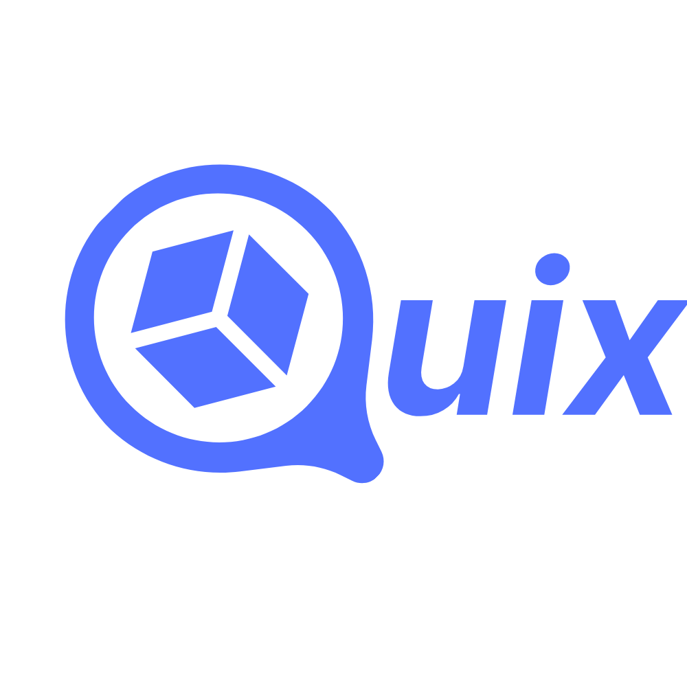

# Users Management System (UMS) for Bookings Application

    

    

## Table of contents

- [Description](#Description)
- [Architecture](#Architecture)
- [Design](#Design)
- [Installation and Configuration](#Installation-and-Configuration)
- [Uses](#Uses)
- [Testing](#Testing)
- [Contributions](#Contributions)
- [License](#License)
- [Security](#Security)

---

## Description:
User Management System (UMS) that functions as the central administration system for a sports facility booking application, providing users with permissions and authorizations to perform specific actions monitored and controlled by the program.

## Architecture:
Given the high scalability of the application, which includes multiple future uses derived from its main reservation function, it was decided to implement a flexible architecture to manage users and adapt to changes. Although Django was initially chosen, research was conducted to assess its compatibility.

It was found that Django is used in applications such as Booking, Rappi, Glovo, Instagram, and Spotify to manage users, authentication, payments, permissions, and profiles, which confirms its ability to scale and handle multiple functionalities. Additionally, Django offers security, integration with modern tools, and ease of maintenance, making it the ideal choice for this system.

Django's user management is robust, allowing the creation of customizable profiles, payment integration, notification implementation, and data analysis, facilitating the personalization and administration of bookings. It also stands out for its ability to handle multimedia content and integrate with machine learning libraries to optimize the experience.

The proposed architecture is based on a central modular system in Django, using an MVC approach and RESTful APIs for integration with microservices. The main components include databases (SQLite/MySQL/PostgreSQL), authentication, APIs for user management, and custom templates. Integration with microservices and the scalability of the system is achieved without affecting the logic of other services.

## Design
1) Organizacion de directorios: El programa cuenta con la siguiente arquitectura limpia y modular.
- `ums/`: ums (Settings), users (App), database, manage file.
- `ums/ums`: Settings, asgi, wsgi & urls files.
- `ums/users/`: Models, views folder (Api), serializers, apps, tests & admin files.
2) Models, attributes, classes attributes, methods:
- `UserManager`:
- `User`: Main model for user management.
- `Profile`: Use the `User` Model for additional data management.
3) Endpoints:
Successful Register:
- `GET / HTTP/1.1` 200
- `GET /register/ HTTP/1.1` 200
- `POST /register/ HTTP/1.1` 302
- `GET / HTTP/1.1` 200

Successful Login:
- `GET / HTTP/1.1` 200
- `POST / HTTP/1.1` 302

Successful Profile (View):
- `GET /profile/ HTTP/1.1` 200

Successful Profile (Edit):
- `POST /profile/ HTTP/1.1` 200

4) Coding style:
- Separation of concerns: Each module has a single responsibility.
- Code reuse: The DRY principle will be followed using mixins in class-based views to reduce redundancies, regardless of pending optimizations.
- Scalability: The application is designed to easily integrate with other services.

## Installation and Configuration commands
1. run in terminal: git clone https://github.com/matimorcos/django-ums-booking-app
2. run in terminal: python -m venv .venv
3. run in terminal: ./.venv/Scripts/activate
4. run in terminl: pip install -r requirements.txt
5. run in terminal: cd ums
6. to create a new secret_key you can:
- open django shell with running in terminal: python manage.py shell and: from django.core.management.utils import get_random_secret_key
print(get_random_secret_key())
- or rn in terminal: python -c "from django.core.management.utils import get_random_secret_key; print(get_random_secret_key())"
7. once you get the new secret key, replace it from ums/ums/settings.py
8. set your db config in ums/ums/settings.py
9. run in terminal: python manage.py makemigrations
10. run in terminal: python manage.py migrate

## Use
The application has the following features:
User registration
User login
View and manage user profile
User & Profile CRUD

1. run in terminal: cd ums
2. run in terminal: python manage.py runserver
3. starting development server at http://127.0.0.1:8000/ (default)
4. once http://127.0.0.1:8000/login/ is displayed on your browser, replace for path http://127.0.0.1:8000/register then you will can login

